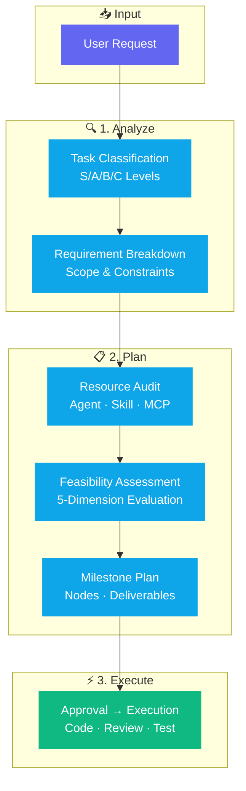

<div align="center">

# 🧠 Claude Plan Action Skill

**Stop guessing. Start planning. — A structured planning framework for Claude Code**

[](https://github.com/donglinfei-debug/claude-plan-action-skill/stargazers)
[](https://github.com/donglinfei-debug/claude-plan-action-skill/issues)
[](https://github.com/donglinfei-debug/claude-plan-action-skill/forks)
[](LICENSE)
[](https://claude.ai)

🌏 **Language / 语言**：[🇨🇳 中文](README.zh.md) | [🇬🇧 English](README.md)

</div>

---

A structured task planning methodology packaged as a Claude Code skill. Transforms how you interact with AI for complex coding tasks — eliminating guesswork, reducing rework, and delivering production-quality code on the first try.

## 🏗️ Workflow



## ✨ Core Features

- **🎯 5-Module Planning Framework** — Goal breakdown, resource audit, feasibility assessment, milestone plan, task orchestration
- **📊 Task Classification** — S/A/B/C levels with appropriate planning depth for each
- **✅ Human-in-the-Loop** — No code is written before you approve the plan
- **🔧 Self-Contained** — Copy the SKILL.md, register it, and it works immediately

## 📦 Requirements

| Requirement | Details |
|:------------|:--------|
| **Claude Code** | Latest version |
| **Installation** | Copy SKILL.md to `.claude/skills/` or use `/plan-action` |

## 📁 Structure

```
claude-plan-action-skill/
├── SKILL.md                    # Skill definition (copy to .claude/skills/)
├── skill-files/
│   ├── SKILL.md                # Full skill source
│   ├── PLAN_TEMPLATE.md        # Execution plan template
│   └── AGENT_REGISTRY.example.json
├── docs/
│   ├── plan-action-guide.md    # Comprehensive usage guide
│   └── scan-results.md
├── CHANGELOG.md
├── LICENSE                     # MIT
└── README.md / README.zh.md
```

## 📄 License

MIT © 2026 Ryan Dong

## 🌟 Star History

[](https://star-history.com/#donglinfei-debug/claude-plan-action-skill&Date)

## 📬 Contact

Ryan Dong — donglinfei@gmail.com
