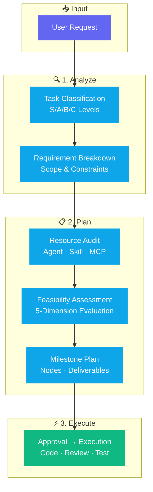

<div align="center">

# 🧠 Claude Plan Action Skill

**Stop guessing. Start planning. — A structured planning framework for Claude Code**

[](https://github.com/donglinfei-debug/claude-plan-action-skill/stargazers)
[](https://github.com/donglinfei-debug/claude-plan-action-skill/issues)
[](https://github.com/donglinfei-debug/claude-plan-action-skill/forks)
[](LICENSE)
[](https://claude.ai)

🌏 **Language / 语言**：[🇨🇳 中文](README.zh.md) | [🇬🇧 English](README.md)

</div>

---

A structured task planning methodology packaged as a Claude Code skill. Transforms how you interact with AI for complex coding tasks — eliminating guesswork, reducing rework, and delivering production-quality code on the first try.


## 📌 Why This?

| Before (Direct Prompting) | After (Structured Planning) |
|:--------------------------|:----------------------------|
| 🤯 AI guesses your intent → writes wrong code → rework cycle | 🎯 AI analyzes requirements → produces a plan → you approve → executes correctly |
| 🧠 Forgets early decisions after 10 conversation rounds | 📋 Locks decisions in a written plan before coding starts |
| 🔍 Discovers all problems at the very end | ✅ Catches issues at each milestone, one at a time |
| ⏱️ Wastes tokens on hallucinated approaches | 💰 Every token works toward an approved direction |

**Claude Plan Action Skill** transforms how you interact with Claude Code for complex coding tasks — eliminating guesswork, reducing rework, and delivering production-quality code on the first try.

## 🏗️ Workflow



## ✨ Core Features

- **🎯 5-Module Planning Framework** — Goal breakdown, resource audit, feasibility assessment, milestone plan, task orchestration
- **📊 Task Classification** — S/A/B/C levels with appropriate planning depth for each
- **✅ Human-in-the-Loop** — No code is written before you approve the plan
- **🔧 Self-Contained** — Copy the SKILL.md, register it, and it works immediately

## 📦 Requirements

| Requirement | Details |
|:------------|:--------|
| **Claude Code** | Latest version |
| **Installation** | Copy SKILL.md to `.claude/skills/` or use `/plan-action` |

## 📁 Structure

```
claude-plan-action-skill/
├── SKILL.md                    # Skill definition (copy to .claude/skills/)
├── skill-files/
│   ├── SKILL.md                # Full skill source
│   ├── PLAN_TEMPLATE.md        # Execution plan template
│   └── AGENT_REGISTRY.example.json
├── docs/
│   ├── plan-action-guide.md    # Comprehensive usage guide
│   └── scan-results.md
├── CHANGELOG.md
├── LICENSE                     # MIT
└── README.md / README.zh.md
```


## ❓ FAQ

**Does this work with any Claude Code version?**
Yes. It works with the latest Claude Code CLI. Copy the SKILL.md to your .claude/skills/ directory and it's ready to use.

**How does task classification work?**
Requests are classified as S/A/B/C based on complexity, risk, and number of files involved. Each level has an appropriate planning depth — from full 5-module plan (S/A) to simple checklist (B/C).

**Can I modify the planning template?**
Yes. The PLAN_TEMPLATE.md in skill-files/ is fully customizable. Adjust the sections to match your team's workflow.

**Does this work with other AI coding tools besides Claude Code?**
The skill format is designed for Claude Code, but the planning methodology (5-module framework) is tool-agnostic and can be adapted to any AI coding assistant.

## 📄 License

MIT © 2026 Ryan Dong

## 🌟 Star History

[](https://star-history.com/#donglinfei-debug/claude-plan-action-skill&Date)


## 👤 About the Author

**Ryan Dong** — AI Product Manager & Full-Stack Developer

I bridge the gap between AI capabilities and production-ready software. My work spans the full stack: from designing AI-powered product features and integrating LLM APIs, to building modular backend services and shipping clean, documented code.

| Role | Focus |
|:-----|:------|
| 🧠 **AI Product Manager** | Product strategy, AI feature design, prompt engineering, model selection |
| 💻 **Full-Stack Developer** | Python, FastAPI, Google Apps Script, automation pipelines, API integration |

This repository is part of a personal toolbox — a growing collection of practical, reusable modules that solve real automation problems. Each project is designed to be independently useful and easily integrated into larger systems.

📬 **donglinfei@gmail.com** — open to business discussions, collaborations, and recruiting inquiries.

## 📬 Contact

Ryan Dong — donglinfei@gmail.com
