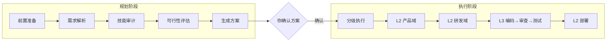

# 🧠 Claude Plan Action Skill（结构化规划技能）

> **告别 AI 的"自由发挥"。** 一个 Claude Code 的结构化规划框架——消除 AI 幻觉、减少返工、一次交付高质量代码。


---

## 📖 这是什么？

**Claude Plan Action** 是一个结构化的任务规划方法论，打包为 Claude Code 技能。它改变了你与 AI 协作复杂任务的方式——

| 传统做法（直接提问） | 结构化规划 |
|:--------------------|:-----------|
| AI 猜测你的意图 → 写错代码 → 反复返工 | AI 分析需求 → 输出方案 → 你确认 → 正确执行 |
| 聊了 10 轮后忘记早期决策 | 用书面方案在编码前锁定决策 |
| 最后才发现所有问题 | 每个节点分阶段验收 |

## ✨ 核心亮点

- **🎯 5 模块规划框架** — 目标拆解、资源审计、可行性评估、工作计划、任务编排
- **📊 任务分级** — S/A/B/C 四级，不同复杂度匹配不同的规划深度
- **✅ 人在回路中** — 方案未经你确认，AI 不得写一行代码
- **🔧 开箱即用** — 复制 SKILL.md 文件、注册到技能清单，立刻可用

## 🚀 快速开始

### 1. 克隆仓库

```bash
git clone https://github.com/donglinfei-debug/claude-plan-action-skill.git
cd claude-plan-action-skill
```

### 2. 复制技能文件到你的 Claude Code 工作区

```bash
mkdir -p /path/to/your/skills/plan-action
cp skill-files/SKILL.md /path/to/your/skills/plan-action/
```

### 3. 注册到项目

在项目 `CLAUDE.md` 的技能清单中添加一行：

```markdown
| plan-action | `skills/plan-action/` | 全盘任务规划 — 分析需求、拆解子任务、调度 Agent 和 Skill、输出执行方案 | `/plan-action {描述}` | 直接在对话中描述需求 |
```

### 4. 使用

```
/plan-action 给我的 Flask 项目加一个用户认证系统
```

Claude 会输出结构化方案，而不是直接写代码。

## 📂 仓库结构

```
├── README.md                          # 英文首页
├── README.zh.md                       # 中文首页
├── CHANGELOG.md                       # 版本历史
│
├── docs/
│   └── plan-action-guide.md           # ★ 完整指南（10章 + 3附录）
│
└── skill-files/
    ├── SKILL.md                       # 可复用的技能定义
    ├── PLAN_TEMPLATE.md               # 5 模块方案模板
    └── AGENT_REGISTRY.example.json    # Agent 注册表示例
```

## 📖 阅读完整指南

完整的方法论、原理和最佳实践请阅读：

➡️ **[完整指南 — docs/plan-action-guide.md](docs/plan-action-guide.md)**

包含：
- 结构化规划如何防止 AI 幻觉
- 5 步流程详解
- 任务分级系统（S/A/B/C）
- Agent + Skill 资源审计方法
- 可行性评估模型
- 完整示例和模板

## 🧠 核心原理

```
AI 编程的 3 大问题 → 结构化规划的 3 个约束

① 指令模糊 → AI 自由发挥
    → 需求解析模板消除模糊性

② 长上下文丢失 → AI 忘记早期决策
    → 书面方案在编码前锁定决策

③ 缺乏校验节点 → 隐藏缺陷累积
    → 节点验收标准在早期捕获问题
```

## 🚀 方法论全景

> 以下全景内容也见于 [个人工具箱](https://github.com/donglinfei-debug/claude-plan-action-skill) 的可视化版本。

### 1. 任务分级体系 <sup>S/A/B/C 四级</sup>

| 级别 | 类型 | 场景 | 流程要求 |
|:----|:-----|:-----|:---------|
| **S 级** | 战略级 | 跨项目/架构变更 | 完整 5 步 + Agent 链 |
| **A 级** | 复杂级 | 多文件 + 设计决策 | 完整 5 步（可简化审计） |
| **B 级** | 常规级 | 单文件 / 逻辑清晰 | 简化版：解析 + 方案 + 确认 |
| **C 级** | 简单级 | 纯执行 / 无歧义 | 直接处理，报备即可 |

> **快速判定**：1 文件 → B/C · 2-5 文件 → A/B · 5+ 文件 → S/A · 有架构决策 → S/A · 高风险 → S

### 2. 两阶段执行流程



### 3. 三层 Agent 架构

```
L1 Controller         总控（分级 + 调度）
 ├── L2 Planner       产品域主
 │    ├── L3 req-writer    需求 / PRD
 │    └── L3 doc-writer    技术文档
 ├── L2 Architect     架构与研发域主
 │    ├── L3 Coder         编码
 │    ├── L3 Reviewer      审查
 │    └── L3 Tester        测试
 └── L2 Deployer      运维域主
```

### 4. 五模块方案模板

| 模块 | 内容 |
|:----|:-----|
| ① **目标理解与拆分** | 核心需求 / 子目标 / 边界约束 |
| ② **技术路径与资源调度** | L2 链 / L3 Agent / Skill / MCP |
| ③ **缺口与需协助事项** | 缺失 Skill / 需你决策 / 需提供 |
| ④ **工作计划和节点** | 每节点：目标 / 验收 / 交付 / 负责人 / 工作量 |
| ⑤ **任务编排** | 串联 / 并行依赖 / 风险与兜底 |

> 更多方法论细节（五维可行性模型、三权分离、三道闸门质量控制等）请阅读 **[完整指南 →](docs/plan-action-guide.md)**

---

## 📄 许可证

[MIT](LICENSE) © 2026 Ryan Dong

## 📬 联系方式

- **作者**: Ryan Dong
- **邮箱**: donglinfei@gmail.com
- **GitHub**: [donglinfei-debug](https://github.com/donglinfei-debug)

---

> 先规划，后编码。一次做对，绝不返工。
