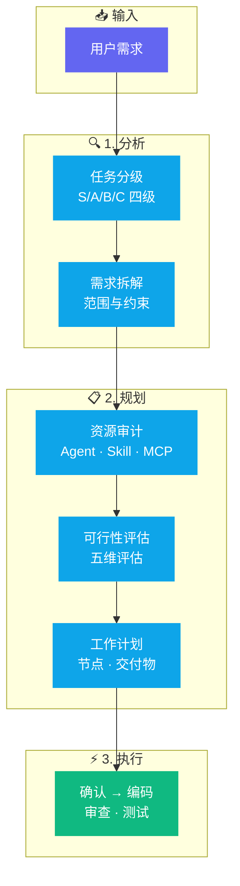

<div align="center">

# 🧠 Claude Plan Action Skill（结构化规划技能）

**告别 AI 的"自由发挥"—— Claude Code 结构化规划框架**

[](https://github.com/donglinfei-debug/claude-plan-action-skill/stargazers)
[](https://github.com/donglinfei-debug/claude-plan-action-skill/issues)
[](https://github.com/donglinfei-debug/claude-plan-action-skill/forks)
[](LICENSE)
[](https://claude.ai)

🌏 **语言 / Language**：[🇨🇳 中文](README.zh.md) | [🇬🇧 English](README.md)

</div>

---

一个 Claude Code 的结构化规划框架——消除 AI 幻觉、减少返工、一次交付高质量代码。通过任务分级（S/A/B/C）、资源审计、五维评估、里程碑规划，确保复杂需求在动手编码前已有清晰的执行方案。


## 📌 为什么需要这个技能？

| 之前（直接提问） | 之后（结构化规划） |
|:----------------|:-----------------|
| 🤯 AI 猜你的意图 → 写出错的代码 → 返工循环 | 🎯 AI 分析需求 → 输出方案 → 你确认 → 一次性写对 |
| 🧠 10 轮对话后早期决定被遗忘 | 📋 所有决策写在计划里，不会丢失 |
| 🔍 最后才发现问题 | ✅ 每个里程碑检查一个，及早发现 |
| ⏱️ Token 浪费在 AI 的胡乱尝试上 | 💰 每条 Token 都在为已确认的方向工作 |

**Claude Plan Action Skill** 改变你和 Claude Code 协作的方式——消除猜测、减少返工、一次交付。

## 🏗️ 工作流程



## ✨ 核心功能

- **🎯 5 模块规划框架** — 目标拆解、资源审计、可行性评估、里程碑规划、任务编排
- **📊 任务分级** — S/A/B/C 四级，按级别决定规划深度
- **✅ 人在回路** — 方案经你确认后才开始编码
- **🔧 即装即用** — 复制 SKILL.md 注册即可使用

## 📦 系统要求

| 要求 | 说明 |
|:-----|:------|
| **Claude Code** | 最新版 |
| **安装方式** | 将 SKILL.md 复制到 `.claude/skills/` 目录 |

## 📁 文件结构

```
claude-plan-action-skill/
├── SKILL.md                    # Skill 定义（复制到 .claude/skills/）
├── skill-files/
│   ├── SKILL.md                # Skill 源码
│   ├── PLAN_TEMPLATE.md        # 执行计划模板
│   └── AGENT_REGISTRY.example.json
├── docs/
│   ├── plan-action-guide.md    # 使用指南
│   └── scan-results.md
├── CHANGELOG.md
├── LICENSE                     # MIT
└── README.md / README.zh.md
```

## ❓ 常见问题

**支持哪个版本的 Claude Code？**
最新版即可。将 SKILL.md 复制到 .claude/skills/ 目录，立即可用。

**任务分级怎么工作的？**
按复杂度、风险、涉及文件数分为 S/A/B/C 四级。每级对应不同的规划深度——S/A 级用完整 5 模块方案，B/C 级简化处理。

**可以修改规划模板吗？**
可以。skill-files/PLAN_TEMPLATE.md 完全可定制，按你的团队工作流调整即可。

**除了 Claude Code，其他 AI 工具能用吗？**
Skill 格式是为 Claude Code 设计的。但 5 模块规划方法论是工具无关的，可适配任何 AI 编码助手。

## 📄 许可证

MIT © 2026 Ryan Dong

## 🌟 Star 历史

[](https://star-history.com/#donglinfei-debug/claude-plan-action-skill&Date)


## 👤 关于作者

**Ryan Dong** — AI 产品经理 & 全栈开发者

我在 AI 能力与生产级软件之间架桥。工作覆盖全栈：从 AI 驱动的产品功能设计、LLM API 集成，到模块化的后端服务和干净、文档完整的代码交付。

| 角色 | 专注领域 |
|:-----|:---------|
| 🧠 **AI 产品经理** | 产品策略、AI 功能设计、Prompt 工程、模型选型 |
| 💻 **全栈开发者** | Python、FastAPI、Google Apps Script、自动化管线、API 集成 |

本仓库是我个人工具箱的一部分——一个不断增长的、解决实际自动化问题的模块集合。每个项目设计为独立可用、易于集成到更大的系统中。

📬 **donglinfei@gmail.com** — 欢迎商务合作、技术交流和招聘联系。

## 📬 联系方式

Ryan Dong — donglinfei@gmail.com
